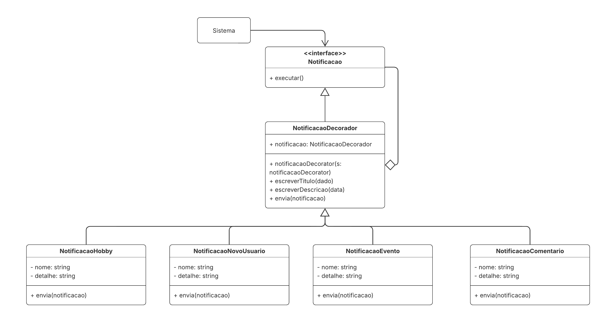

# Decorator

## Introdução

O padrão de projeto **Decorator** tem como principal objetivo adicionar comportamentos ou responsabilidades a objetos de forma dinâmica, sem modificar sua estrutura original. Ele pertence ao grupo dos **padrões estruturais**, pois foca na composição de objetos para criação de estruturas mais flexíveis. A ideia central é envolver o objeto original dentro de outro que implementa a mesma interface, delegando chamadas enquanto adiciona novas funcionalidades. Essa abordagem evita o uso excessivo de herança, promovendo maior reutilização e adaptabilidade do código (Gamma et al., 2000).  

Entre os benefícios mais relevantes do Decorator estão a **flexibilidade**, por permitir a combinação de diferentes funcionalidades em tempo de execução; e o **baixo acoplamento**, já que os novos comportamentos são adicionados por composição, e não por alteração do código existente. O padrão segue o princípio “aberto para extensão, mas fechado para modificação”, sendo amplamente aplicado em sistemas onde é necessária a expansão controlada de funcionalidades, como em interfaces gráficas e fluxos de dados (Refactoring Guru, 2025; Sourcemaking, 2025).

## Metodologia

O desenvolvimento do GoF Decorator foi realizado a partir do estudo do materiais fornecidos pela professora Milene Serrano no slide de GoF Estruturais e, também, no livro Gamma el al. (2000). Após cada leitura individal, foram feitas reuniões com os integrantes desse subgrupo: [Ana Luiza Soares](https://github.com/Ana-Luiza-SC), [Leonardo Barcellos](https://github.com/oyLeonardo) e [Yzabella Pimenta](https://github.com/redjsun) no software [Teams](https://teams.microsoft.com/v2/?skipauthstrap=1).

Durante as reuniões de estruturação do nosso padrão de projeto, utilizamos como embasamento na montagem da modelagem as fontes de Refactoring Guru (2023) e SourceMaking (2023), as quais nos auxiliaram a compreender de modo mais amplo e simplificado como poderiamos encaixar e utilizar esse padrão no nosso próprio projeto. 


Além das reuniões via Teams, também tivemos debates da estruturação por meio do [WhatsApp](https://www.whatsapp.com). Neste, mandamos algumas imagens de como estava ficando o diagrama e realizando a apuração se todos concordávamos. No fim, conseguimos desenvolver uma modelagem que fosse pertinente com o material estudado e com o entendimento de cada integrante desse subgrupo. 


### Gravações
<p align="center">Tabela 1 - Gravações das reuniões de estruturais</p>

| Reunião | Integrantes | Data | Link |
| :---- | :---- | :---- | :---- |
| 01 | [Ana Luiza Soares](https://github.com/Ana-Luiza-SC) e [Yzabella Miranda](https://github.com/redjsun) | 21/10/2025 | [Reunião 1](https://unbbr.sharepoint.com/:v:/s/arquitetos/Ed41PuBE6tBIlQDr-O4zIpABPUC-ss5GqA6JWMOxkoCMtw?e=VFLzGX) |

## Modelagem
Com a decisão final do diagrama, abaixo é possível visualizá-lo:

<p align="center">Imagem  1 - Modelagem do GoF Builder</p>



<p align = "center">Autoria de <a href="https://github.com/Ana-Luiza-SC">Ana Luiza Soares</a>, <a href="https://github.com/oyLeonardo">Leonardo Barcelos</a> e <a href="https://github.com/redjsun">Yzabella Miranda</a> </p>

## Implementação

Além da modelagem, é possível visualizar a implementação do nosso modelo, abaixo:

```bash
from abc import ABC, abstractmethod
from datetime import datetime
from typing import Optional
class Notificacao(ABC):
	@abstractmethod
	def executar(self):
		pass
class NotificacaoDecorador(Notificacao):
	def __init__(self, notificacao: Optional[Notificacao] = None):
		self._notificacao = notificacao
		self._titulo = ""
		self._descricao = ""
	def escreverTitulo(self, dado: str):
		self._titulo = dado
	def escreverDescricao(self, data: str):
		self._descricao = data
	def envia(self, notificacao: str):
		print(f" Notificação: {notificacao}")
	def executar(self):
		if self._notificacao:
			self._notificacao.executar()
class NotificacaoHobby(NotificacaoDecorador):
	def __init__(self, nome: str, detalhe: str, notificacao: Optional[Notificacao] = None):
		super().__init__(notificacao)
		self.nome = nome
		self.detalhe = detalhe
	def enviar(self):
		msg = f" + [Hobby] Novo hobby cadastrado: {self.nome} - {self.detalhe}"
		self.envia(msg)
	def executar(self):
		super().executar()
		self.enviar()
class NotificacaoNovoUsuario(NotificacaoDecorador):
	def __init__(self, nome: str, detalhe: str, notificacao: Optional[Notificacao] = None):
		super().__init__(notificacao)
		self.nome = nome
		self.detalhe = detalhe
	def enviar(self):
		msg = f" + [Usuário] Bem-vindo(a) {self.nome}! {self.detalhe}"
		self.envia(msg)
	def executar(self):
		super().executar()
		self.enviar()
class NotificacaoEvento(NotificacaoDecorador):
	def __init__(self, nome: str, detalhe: str, notificacao: Optional[Notificacao] = None):
		super().__init__(notificacao)
		self.nome = nome
		self.detalhe = detalhe
	def enviar(self):
		msg = f" + [Evento] {self.nome}: {self.detalhe} - {datetime.now().strftime('%d/%m/%Y %H:%M')}"
		self.envia(msg)
	def executar(self):
		super().executar()
		self.enviar()
class NotificacaoComentario(NotificacaoDecorador):
	def __init__(self, nome: str, detalhe: str, notificacao: Optional[Notificacao] = None):
		super().__init__(notificacao)
		self.nome = nome
		self.detalhe = detalhe
	def enviar(self):
		msg = f" + [Comentário] {self.nome}: {self.detalhe}"
		self.envia(msg)
	def executar(self):
		super().executar()
		self.enviar()
if __name__ == "__main__":
	# Cria notificações independentes
	n1 = NotificacaoHobby("Fotografia", "Novo hobby adicionado ao sistema.")
	n2 = NotificacaoNovoUsuario("Ana", "Sua conta foi criada com sucesso.")
	n3 = NotificacaoEvento("Hackathon", "Evento de programação neste fim de semana.")
	n4 = NotificacaoComentario("Carlos", "Comentou na sua publicação.")
	print("\n--- Notificações Individuais ---")
	n1.executar()
	n2.executar()
	n3.executar()
	n4.executar()
	
	print("\n--- Notificações Encadeadas ---")
	noti_composta = NotificacaoComentario("Maria", "Respondeu seu comentário.",
					   NotificacaoEvento("Workshop Python", "Hoje às 19h.",
					   NotificacaoNovoUsuario("João", "Acabou de se registrar.")))
	noti_composta.executar()

```

### Testar o código

Para testar o código, é fundamental seguir os passos abaixo:

Primeiro, clone o repositório:
``` bash
git clone https://github.com/UnBArqDsw2025-2-Turma01/2025.2-T01-G3_ReveleSeuHobbie_Entrega_03
```

Vá para a pasta yal:
``` bash
cd yal
```

Compile o arquivo .py referente ao decorator:
``` bash
python decorator.py
```

## Referências Bibliográficas

GAMMA, Erich; HELM, Richard; JOHNSON, Ralph; et al. **Padrões de projetos: soluções reutilizáveis de software orientados a objetos**. Porto Alegre: Bookman, 2000\. *E-book.* p.99. ISBN 9788577800469\. Disponível em: [https://app.minhabiblioteca.com.br/reader/books/9788577800469/](https://app.minhabiblioteca.com.br/reader/books/9788577800469/). Acesso em: 23 out. 2025\.  
SERRANO, Milene. **AULA \- GOFS ESTRUTURAIS**. 2025\. Disponível em: [https://aprender3.unb.br/pluginfile.php/3178397/mod_page/content/1/Arquitetura%20e%20Desenho%20de%20Software%20-%20Aula%20GoFs%20Estruturais%20-%20Profa.%20Milene.pdf](https://aprender3.unb.br/pluginfile.php/3178396/mod_page/content/1/Arquitetura%20e%20Desenho%20de%20Software%20-%20Aula%20GoFs%20Criacionais%20-%20Profa.%20Milene.pdf). Acesso em: 23 out. 2025,   
REFACTORING GURU. **Padrão de Projeto Decorator**. Disponível em: [Decorator Guru](https://refactoring.guru/pt-br/design-patterns/decorator). Acesso em: 23 out. 2025\.  
SOURCEMAKING. **Decorator Design Pattern**. Disponível em: [Decorator Design Pattern](https://sourcemaking.com/design_patterns/decorator). Acesso em: 23 out. 2025\.

## Tabela de Versionamento

| Versão | Data       | Descrição                                        | Autor(es)           | Revisor(es)         | Comentário do revisor | Data da revisão |
|--------|------------|--------------------------------------------------|---------------------|---------------------|----------------------|-----------|
| `1.0` | 17/10/2025  | Criação da Modelagem e código do padrão de projeto Decorator | [Ana Luiza Soares](https://github.com/Ana-Luiza-SC), [Leonardo Barcelos](https://github.com/oyLeonardo) e [Yzabella Miranda](https://github.com/redjsun) | [Matheus de Alcântara](https://github.com/matheusdealcantara) | O arquivo está bem estrturturado e sem erros gramaticais. | 24/10/2025 |