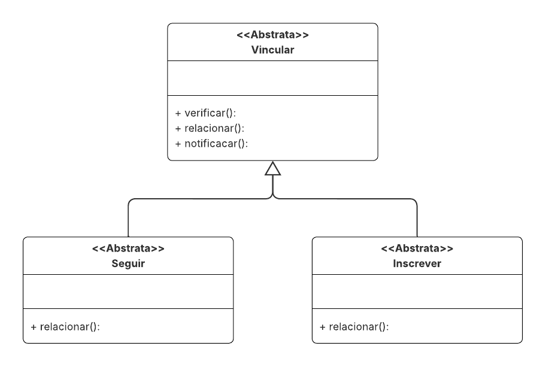

# Template Method

## Introdução

Os padrões de projeto comportamentais têm como propósito definir maneiras eficientes de organizar a interação e a responsabilidade entre classes e objetos, promovendo a reutilização de algoritmos e o controle do fluxo de execução (GAMMA et al., 1995).

Entre esses padrões, o **Template Method** se destaca por definir o esqueleto de um algoritmo em uma superclasse, permitindo que subclasses concretas personalizem etapas específicas sem alterar a estrutura geral do processo (REFACTORING GURU, 2023). Essa abordagem facilita a padronização de comportamentos, promove a inversão de controle e reduz a duplicação de código, tornando o GoF Template Method ideal para sistemas que exigem variações controladas de um mesmo procedimento (SOURCEMAKING, 2023).

## Metodologia

A construção do **GoF Template Method** foi realizada a partir dos conhecimentos adquiridos durante as aulas ministradas pela professora Milene Serrano e do material de apoio GoF Comportamentais (2025), além da análise da literatura do livro *Gamma et al. (2000)*.

Durante o processo de desenvolvimento, os integrantes do grupo apresentaram diferentes interpretações sobre o comportamento e a aplicabilidade dos padrões comportamentais. Assim, foram realizadas quatro reuniões para alinhar conceitos e modelagens. A primeira, ocorrida no dia 15/09, não resultou em consenso — a gravação dessa reunião acabou ficando extensa e, por não conter avanços significativos, o grupo optou por não incluí-la na documentação. Já a segunda reunião, no dia 17/09, teve duração de aproximadamente 3 horas e foi fundamental para definir a estrutura e as classes principais do padrão.

Na última etapa, o grupo incorporou duas novas referências teóricas: Refactoring Guru (2023) e SourceMaking (2023). Essas fontes permitiram uma compreensão mais profunda sobre a intenção e a estrutura do padrão Template Method, o que possibilitou adaptar seu uso para o contexto do fórum em desenvolvimento — principalmente nas funcionalidades que exigem comportamentos padronizados com variações específicas, como as ações de publicar, comentar e seguir.

Conforme descrito por Refactoring Guru (2023), o Template Method é composto pelos seguintes elementos:

**Classe Abstrata (Abstract Class)**: define o template method, isto é, o esqueleto do algoritmo, delegando algumas etapas a subclasses;

**Método Template (Template Method)**: organiza a execução das operações em uma sequência fixa;

**Operações Concretas e Abstratas:** as operações abstratas são implementadas pelas subclasses, enquanto as concretas podem ser reutilizadas ou redefinidas conforme necessário.

A aplicação desse padrão permitiu estabelecer um fluxo comum de ações nas funcionalidades do sistema, ao mesmo tempo em que manteve a flexibilidade para variações específicas de cada tipo de interação.

 As gravações das reuniões estão a seguir: 


<p align="center">Tabela 1 - Gravações das reuniões de execução</p>

| Reunião | Integrantes | Data | Link |
| :---- | :---- | :---- | :---- |
| 01 | [Ana Luiza Soares](https://github.com/Ana-Luiza-SC) e [Leonardo Barcelos](https://github.com/oyLeonardo) | 22/10/2025 | [https://unbbr.sharepoint.com/sites/arquitetos/_layouts/15/stream.aspx?id=%2Fsites%2Farquitetos%2FDocumentos%20Compartilhados%2FGeneral%2FRecordings%2Fmuitos%20assuntos%20%2D%20ana%20e%20leo%2D20251022%5F212033%2DGrava%C3%A7%C3%A3o%20de%20Reuni%C3%A3o%2Emp4&referrer=StreamWebApp%2EWeb&referrerScenario=AddressBarCopied%2Eview%2E87b3f3be%2Dd915%2D41fd%2Db8ea%2D3ab78b60eb38](https://unbbr.sharepoint.com/sites/arquitetos/_layouts/15/stream.aspx?id=%2Fsites%2Farquitetos%2FDocumentos%20Compartilhados%2FGeneral%2FRecordings%2Fmuitos%20assuntos%20%2D%20ana%20e%20leo%2D20251022%5F212033%2DGrava%C3%A7%C3%A3o%20de%20Reuni%C3%A3o%2Emp4&referrer=StreamWebApp%2EWeb&referrerScenario=AddressBarCopied%2Eview%2E87b3f3be%2Dd915%2D41fd%2Db8ea%2D3ab78b60eb38) |


<p align = "center">Autoria de <a href="https://github.com/Ana-Luiza-SC">Leonardo Barcellos</a> </p>

## Modelagem

A seguir, é possível visualizar a foto da modelagem gerada:
<p align="center">Imagem  1 - Modelagem do GoF Template Method</p>



<p align = "center">Autoria de <a href="https://github.com/Ana-Luiza-SC">Ana Luiza Soares</a>, <a href="https://github.com/oyLeonardo">Leonardo Barcelos</a> e <a href="https://github.com/redjsun">Yzabella Miranda</a> </p>

## Implementação
```python
from abc import ABC, abstractmethod
class Vincular(ABC):
	
	def executar(self, id_usuario, id_alvo):
		if not self.validar(id_usuario, id_alvo):
			print("Ação inválida!")
			return False
		
		self.relacionar(id_usuario, id_alvo)
		
		self.notificar(id_usuario, id_alvo)
		
		return True
	
	@abstractmethod
	def validar(self, id_usuario, id_alvo):
		pass
	
	@abstractmethod
	def relacionar(self, id_usuario, id_alvo):
		pass
	
	def notificar(self, id_usuario, id_alvo):
		print(f"Usuário {id_usuario} realizou ação com {id_alvo}")
		
class Seguir(Vincular):
	
	def validar(self, id_usuario, id_seguido):
		return id_usuario != id_seguido 
	
	def relacionar(self, id_usuario, id_seguido):
		print(f"Usuário {id_usuario} agora segue {id_seguido}")
class Inscrever(Vincular):
	
	def validar(self, id_usuario, id_comunidade):
		return id_usuario != id_comunidade  
	
	def relacionar(self, id_usuario, id_comunidade):
		print(f"Usuário {id_usuario} se inscreveu na comunidade {id_comunidade}")
seguir = Seguir()
seguir.executar("user1", "user2")
inscrever = Inscrever()
inscrever.executar("user3", "comunidade")
seguir.executar("clarissa", "yzabella")
```

## Referências Bibliográficas

GAMMA, Erich; HELM, Richard; JOHNSON, Ralph; et al. **Padrões de projetos: soluções reutilizáveis de software orientados a objetos**. Porto Alegre: Bookman, 2000\. *E-book.* p.99. ISBN 9788577800469\. Disponível em: [https://app.minhabiblioteca.com.br/reader/books/9788577800469/](https://app.minhabiblioteca.com.br/reader/books/9788577800469/). Acesso em: 20 out. 2025\.  
SERRANO, Milene. **AULA \- GOFS COMPORTAMENTAIS**. 2025\. Disponível em: [https://unbbr-my.sharepoint.com/personal/mileneserrano_unb_br/_layouts/15/stream.aspx?id=%2Fpersonal%2Fmileneserrano%5Funb%5Fbr%2FDocuments%2FArqDSW%20%2D%20V%C3%ADdeosOriginais%2F10a%20%2D%20Video%2DAula%20%2D%20DSW%20%2D%20GoFs%20%2D%20Comportamentais%2Emp4&ga=1&referrer=StreamWebApp%2EWeb&referrerScenario=AddressBarCopied%2Eview%2E06220199%2D163a%2D4153%2Db781%2D5ddd7f814eec](https://unbbr-my.sharepoint.com/personal/mileneserrano_unb_br/_layouts/15/stream.aspx?id=%2Fpersonal%2Fmileneserrano%5Funb%5Fbr%2FDocuments%2FArqDSW%20%2D%20V%C3%ADdeosOriginais%2F10a%20%2D%20Video%2DAula%20%2D%20DSW%20%2D%20GoFs%20%2D%20Comportamentais%2Emp4&ga=1&referrer=StreamWebApp%2EWeb&referrerScenario=AddressBarCopied%2Eview%2E06220199%2D163a%2D4153%2Db781%2D5ddd7f814eec). Acesso em: 22 out. 2025,   
REFACTORING GURU. *Padrão de Projeto Behavioral*. Disponível em: [https://refactoring.guru/design-patterns/behavioral-patterns](https://refactoring.guru/design-patterns/behavioral-patterns). Acesso em: 22 out. 2025\.  
SOURCEMAKING. *Template Design Pattern*. Disponível em: [https://refactoring.guru/design-patterns/template-method](https://refactoring.guru/design-patterns/template-method). Acesso em: 22 out. 2025\.  

## Tabela de Versionamento

| Versão | Data       | Descrição                                        | Autor(es)           | Revisor(es)         | Comentário do revisor | Data da revisão |
|--------|------------|--------------------------------------------------|---------------------|---------------------|----------------------|-----------|
| `1.0` | 23/10/2025  | Criação da estrutura inicial do documento, com introdução, metodologia utilizada, link para vídeos e referência bibliográfica | [Leonardo Barcellos](https://github.com/oyLeonardo)  | | - | - |
